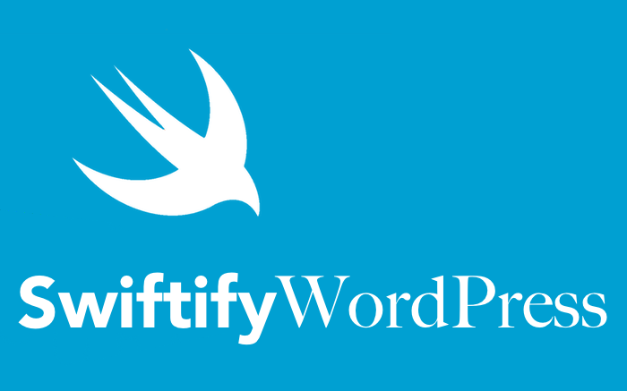

[![Swift Version][swift-image]][swift-url]
[![License][license-image]][license-url]
[](http://cocoapods.org/pods/LFAlertController)
[](https://swift.org/package-manager/)
[](http://makeapullrequest.com)

# iOSPress
<br />
<p align="center">
  <a href="https://github.com/kazi-mifta/iOSPress">
    
  </a>
  <p align="center">
  </p>
</p>

Turn Your WordPress Website into a Native iOS App. Just Simply add the framework through swift package manager.

<p align="row">


</p>


## Features

- [x] Show latest 20 posts from blog
- [x] In-App Browser 
- [x] Show all Posts of a Website through Pagination
- [x] Extend Browser features
-  Categorize Posts According to tags

## Techonologies Used

- Swift, SwiftUI
- MVVM
- URLSession(Network Layer)
- Codable(JSON Parsing)


## Requirements

- iOS 13.0+
- Xcode 12.0+

## Installation

#### Swift Package Manager

iOSPress is available through [Swift Package Manager](https://swift.org/package-manager/).

+ For App integration

For App integration, you should using Xcode 12 or higher, to add this package to your App target. To do this, check [Adding Package Dependencies to Your App](https://developer.apple.com/documentation/xcode/adding_package_dependencies_to_your_app?language=objc) about the step by step tutorial using Xcode.


#### Manually
Download the files in Sources\iOSPress and use the PostListView with your site's URL. Don't forget to add the dependencies. This project requires SDWebImageSwiftUI.
```swift
struct ContentView: View {
    var body: some View {
        // PostsListView(with: PostsData(url: "Your Website's Base URL"))
        PostsListView(with: PostsData(url: "gadgetanalysis.com"))
    }
}
```
## Usage example 
After importing the package you can add the list view of Posts using a single line in your View's Body.
```swift
import iOSPress

struct ContentView: View {
    var body: some View {
        // PostsListView(baseUrl: "Your Website's Base URL")
        PostsListView(with: PostsData(url: "gadgetanalysis.com"))
    }
}
```

## Contribute

I would really appreciate your contribution to **iOSPress**. Feel Free to contact with me if you want to contribute or just send a pull request.

## Contact

Kazi Miftahul Hoque – kazimifta13@gmail.com

## License

iOSPress is available under the GPLv3 license. See ``LICENSE`` for more information.


[swift-image]:https://img.shields.io/badge/swift-5.0-orange.svg
[swift-url]: https://swift.org/
[license-image]: https://img.shields.io/badge/License-GPLv3-blue.svg
[license-url]: LICENSE
[codebeat-image]: https://codebeat.co/badges/c19b47ea-2f9d-45df-8458-b2d952fe9dad
[codebeat-url]: https://codebeat.co/projects/github-com-vsouza-awesomeios-com
